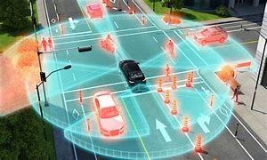
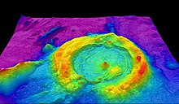

Spekter za aplikacij z LiDAR-jem je ekstremno širok

##### Avtonomna vozila
Najpogosteje se uporablja v implementaciji s kamero za informacijo o globini.

 
 
 
 

##### Mapiranje terena
LiDAR sistem je nameščen na letalo in meri višinsko razgibanost površja.
Z upoštevanjem šuma, ki ga pri meritvah povzročajo drevesa in ostala vegetacija, je možno meriti višino dreves in gozdno površino.
![[images/Pasted image 20230402212629.png]]

Mapiranje morskega dna. 
Uporabljeni so laserski žarki zelenega spektra svetlobe (532nm), saj svetloba te valovne dolžine potuje najdlje v vodi. Tukaj je natančnost odvisna predvsem od čistoče in umirjenosti vode.

##### Merjenje delcev v zraku
Pridobivanje informacij o onesnaženju zraka, z analizo razpršitve odboja svetlobe, ko žarek zadane delce v zraku. Z meritvami intenzivnosti odbitega žarka lahko ugotovimo velikost, obliko in koncentracijo delcev v zraku.

