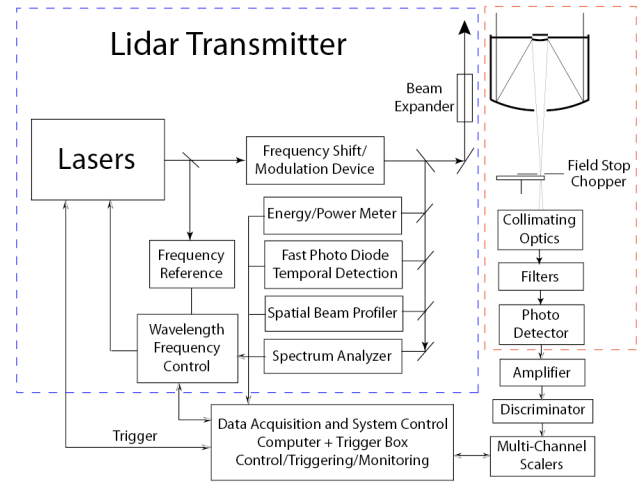

```ToDo
TODO:
- Opiši vsak del (laserdiodo, katere se uporabljajo, fotoelektrični senzor)
	- Opiši hardware vsakega dela 
- konfiguracija (bistatic, monostatic)
	- monostatic polarizacija
- biaxial, coaxial can we have biaxial monostatic lidar?
- kako poteka prenos podatkov med komponentami
- fraunhofer lines ??
```


LiDAR sistem je konstruiran iz oddajnika in sprejemnika svetlobe, ter računalnika, 
ki pretvori dobljene podatke v uporabno informacijo.

##### Oddajnik svetlobe
Katera laser dioda, vrste diod


##### Sprejemnik svetlobe
Explain photoelectric effect


##### Procesni del
Kateri čip, posebni counterji


##### Prenos podatkov


#### Konfiguracija LiDAR-ja   
##### Bistatična 
Delovanje po istem principu kot bistatični radar.
Oddajnik in sprejemnik sta ločeni napravi, ki sta nameščeni na različnih mestih. Računanje razdalje deluje kot pri bistatičnem radarju.


Primer:
Bistatičen LiDAR sistem za določanje onesnaženja letalskih območij:
Oddajnik oddaja žarke na dveh v naprej določenih valovnih frekvencah.
Prva $\lambda_{ON}$

 
##### Monostatična

Samostojna optična naprava, ki hkrati oddaja in sprejema laserske žarke.
Merjenje razdalje se računa z časovnim intervalom, v katerem žarek oddajnika potuje do tarče, se od nje odbije in ponovi isto pot do sprejemnika.
$$d = \frac{c \cdot t}{2}$$
Ker sta oddajnik in sprejemnik vgrajena v isto napravo, sta nameščena blizu
eden drugega, zato se dajlici poti oddajnika in sprejemnika prekrivata. 
Prekrivanje oddanega in odbitega žarka se rešuje z prekinjenim oddajanjem laserskega oddajnika.


#### Ureditev komponent 

##### Biaksialna ureditev 
Laserski oddajnik in sprejemnik sta ločena.
Laserski žarek oddajnika, vstopi v vidno polje sprejemnika le na določeni razdaliji


##### Koaksialna ureditev 
Laserski žarek sovpada z optiko sprejemnika.


